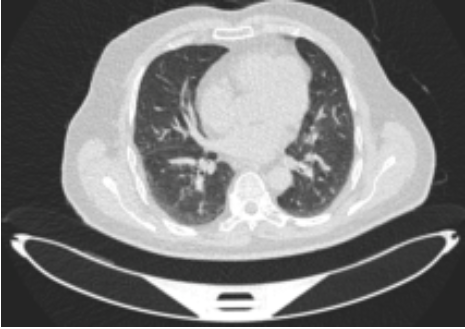

# AIHealthLungCancer
The *AI + Health Lung Cancer* Machine Learning model is a machine-learning model that uses computer vision to classify tumors in chest/lung CT scans. Our goal with this software is to help detect lung tumors that might have went unnoticed. We built our model based on lung cancer because when looking at the 4 leading types of cancer-related deaths in the United States, we saw that lung cancer accounted for more than half of the other three combined (colorectal, breast, prostate). Future expansions of the software may include forgoing the use of CT scans, as CT scans have many shortcomings that will be discussed below. The *AI + Health Lung Cancer* Machine Learning model is a tool that will hopefully be beneficial to researchers in both healthcare and computer science/artifical intelligence fields as it demonstrates the potential AI has in medical applications. 

Try out the model on our website!
https://sites.google.com/view/cv-to-detect-lung-cancer/our-model

## Project Impact
When looking at the 4 leading types of cancer-related deaths in the United States, we saw that lung cancer accounted for more than half of the other three combined, including colorectal, breast, and prostate cancers. For our team (AI4ALL AI + Health Special Interest Group), this fact emphasized the need for intervention and research into the topic of lung cancer, specifically in detection and diagnosis as this will serve as a preventative measure and provide a way to reduce patient mortality by providing the opportunity for earlier intervention through accurate diagnosis. 

When looking at lung cancer, we see that as the stage of cancer becomes more severe, the survival rate decreases exponentially (Stage I: 54%, Stage II: 35%, Stage III: 10%, Stage IV: <2%). This clearly indicates that for many patients, early detection will be the difference between life and death. However, Many lung cancer patients do not find out they have lung cancer until it’s too late because CT scans are hard to request if the patient only has mild symptoms. Also, major symptoms such as coughing is often dismissed. We wanted to focus our project on CT scans since even when CT scans are performed, small tumors can be easily overlooked.

## Background on CT Scans
A CT scan is a medical imaging technique that uses X-ray images taken from different angles to create detailed 3D images of the body. CT scans are preferred by medical professionals for its extremely detailed and noninvasive diagnosis on patients (revealing the size, shape, and position of tumors). Other imaging techniques like MRIs and regular X-rays have distinct disadvantages (cost, less detail leading to wrong diagnosis). CT scans can also be used to differentiate between benign and malignant tumors. 

Just because CT scans are the preferred method for cancer detection does not mean it does not have its own shortcomings. CT scans are difficult to perform routinely because of its exposure of patients to radioactivity (exposure caused by the many X-ray images required for the full scan). An excess amount of CT scans would lead to more issues on the behalf of the patient, as radioactivity is a known carcinogen and harmful to the human body. 

This gave us a reason to use CT scans, despite its shortcomings: if we are able to use the CT scans we have more efficiently by correctly identifying any tumors in the scan, patients will not have to go through more unnecessary scans that might potentially cause them further damage.

## See more about the model in the MODEL folder!

## Future Improvements
We faced many hardware and software limitations when creating this model. We were limited by Google Colab's free software limitations. We were also unable to work with a larger, 124GB dataset that was available, because of our group's limitations on memory.

Also, we are still working on a user interface on our website (https://sites.google.com/view/cv-to-detect-lung-cancer/home). We made this website so that users could learn about lung cancer, our project, and input their own data into the machine learning model. Users can be anybody– patients, doctors, or anyone’s who’s interested in running a ML model (we will provide sample data). The ML model will be embedded in the future.

Finally, creating a similar model for other types of cancers may further the access of patients to accurate diagnosis, while also expanding the use of artificial intelligence in hospitals and healthcare.

## Credits
**Leaders**: Julianna Gallup & Adithi Vardhan

**Members:** Kenan Erol, Anu Nair, Helen Liu, Tasnim Taifa, Iris Xue

**Mentor:** Naquan Ishman 

## License
[Apache License 2.0](LICENSE.md)
